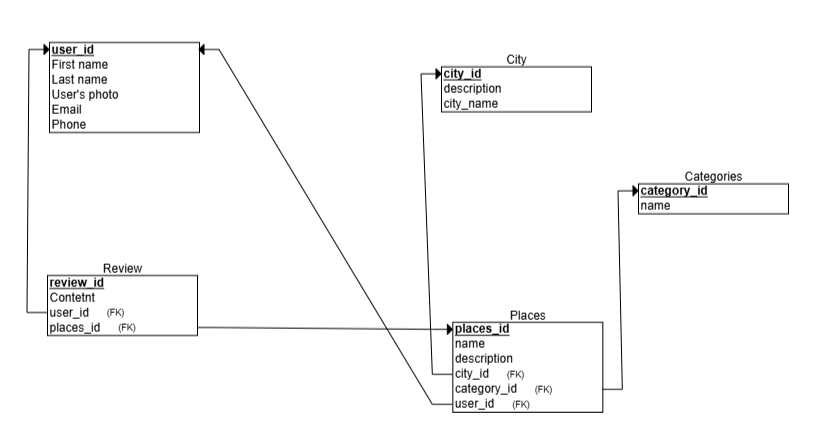

# Dalilah_Backend

This project represents the backend system for the Dalilah application, a platform where users can explore cities, browse local places by category, save their favorite spots, and share their experiences through reviews.

---

## 🗺️ Entity Relationship Diagram (ERD)

The following diagram illustrates the relationships between the main models (User, City, Category, Place, Review):



---

## 🌐 RESTful Routing

RESTful routing stands for **Representational State Transfer** and uses our resources (entities in our database) as the focal point of how to organize our code. It emphasizes treating data as the single source of truth, ensuring that our client requests interact properly with server endpoints through CRUD operations:

- (C) Create  
- (R) Read  
- (U) Update  
- (D) Delete

---

## 🔐 User Authentication
| HTTP Verb | Path                    | Action  | Description                          |
|-----------|-------------------------|---------|--------------------------------------|
| POST      | /users/signup/          | signup  | Register a new user                  |
| POST      | /users/login/           | login   | User login and return tokens         |
| GET       | /users/token/refresh/   | refresh | Refresh the JWT token                |

---

## 🏙️ Cities
| HTTP Verb | Path              | Action | Description                        |
|-----------|-------------------|--------|------------------------------------|
| GET       | /cities/          | index  | List all cities                    |
| GET       | /cities/:city_id/ | show   | Show details of a specific city    |

---

## 🧭 Categories
| HTTP Verb | Path                  | Action | Description                              |
|-----------|-----------------------|--------|------------------------------------------|
| GET       | /categories/          | index  | List all categories                      |
| GET       | /categories/:id/      | show   | Show details of a specific category      |

---

## 📍 Places
| HTTP Verb   | Path                         | Action  | Description                                 |
|-------------|------------------------------|---------|---------------------------------------------|
| GET         | /places/                     | index   | List all places                             |
| POST        | /places/                     | create  | Add a new place                             |
| GET         | /places/:place_id/           | show    | Show a specific place                       |
| PUT/PATCH   | /places/:place_id/           | update  | Update an existing place                    |
| DELETE      | /places/:place_id/           | destroy | Delete a place                              |

---

## 💬 Reviews
| HTTP Verb   | Path                                   | Action  | Description                              |
|-------------|----------------------------------------|---------|------------------------------------------|
| GET         | /places/:place_id/reviews/             | index   | List all reviews for a specific place    |
| POST        | /places/:place_id/reviews/             | create  | Create a review for a specific place     |
| PUT/PATCH   | /reviews/:review_id/                   | update  | Update a specific review                 |
| DELETE      | /reviews/:review_id/                   | destroy | Delete a specific review                 |

---

## 👤 User Stories

### Visitor
- Sign up to add places and write reviews
- Login to access features and interact with the app

### Registered User
- Browse cities and select one to explore
- Filter places by category
- View place details
- Add a new place via form (with dropdowns for city/category)
- Write, edit, and delete reviews
- Manage personal recommendations in a separate page

---

## 🧠 What I Learned
- Building a secure and structured REST API using Django REST Framework  
- Implementing JWT Authentication and token refreshing  
- Handling relationships between models effectively  
- Writing reusable, scalable views using DRF and APIView  
- Dockerizing a full-stack project and managing services  
- React state management and API consumption

---

## 💡 Code I’m Proud Of

One part of the backend I’m especially proud of is the `ReviewListCreateAPIView`, which efficiently handles both retrieving and adding reviews for a specific place. It ensures reviews are linked to the correct user and place while enforcing authentication.

```python
class ReviewListCreateAPIView(APIView):
    permission_classes = [permissions.IsAuthenticated]

    def get(self, request, place_id):
        reviews = Review.objects.filter(place_id=place_id)
        serializer = ReviewSerializer(reviews, many=True)
        return Response(serializer.data, status=status.HTTP_200_OK)

    def post(self, request, place_id):
        data = request.data.copy()
        place = Place.objects.get(id=place_id)
        data['place_id'] = place
        serializer = ReviewSerializer(data=data)
        if serializer.is_valid():
            serializer.save(user=request.user, place=place)  # ربط الريفيو بالمستخدم
            return Response(serializer.data, status=status.HTTP_201_CREATED)
        return Response(serializer.errors, status=status.HTTP_400_BAD_REQUEST)

```


## 💻Website Features

- Fully responsive interface using React
- Video hero section with animated header
- Smooth route transitions with protected access
- Review system with edit/delete options
- Dynamic loading and splash animation
- Conditional rendering based on user state
- Location opens in **Google Maps** via clickable label
- "Your Recommendations" page with full CRUD functionality

---

## 🔮 Icebox / Future Features

- ⭐ **Place Rating System:** Allow users to rate places based on their experience
- 📌 **User Badging:** Promote top contributors to official locals for the platform
- 🖼️ **Image Upload:** Support user-uploaded images for each place
- 🗺️ **Embedded Interactive Maps:** Display map previews of each location
- 🔔 **Real-Time Notifications:** Notify users when a new place or review is added
- 🌍 **User Profiles:** Show user’s added places and reviews
- 📲 **Social Media Sharing:** Allow users to share reviews or places directly
- 🧠 **Smart Suggestions:** Suggest places based on what users save or review

---

## 🔗 Project Links

| Item            | Link                          |
|-----------------|-------------------------------|
| Backend         | http://localhost:8000         |
| Frontend        | http://localhost:5173         |
| Frontend Repo   | https://github.com/Abdullah-Alhammadi/Dalilah_Frontend |
| Backend Repo    | https://github.com/Abdullah-Alhammadi/Dalilah_Backend  |

---

## 🐳 Installation (Docker)

```bash
# Clone the project
git clone <your-backend-repo-url>
cd dalilah_backend

# Start Docker
docker compose up --build

```


## 🏁 Final Notes

Dalilah was built to provide a **local-first discovery experience**, where users can explore cities through real recommendations shared by locals — not generic tourist lists. The app combines a clean user experience with essential CRUD functionality, JWT authentication, and dynamic data loading. 

With more time, Dalilah could evolve into a full-featured social travel platform where locals earn badges, places are rated, and profiles showcase user contributions. I'm proud of what I’ve built, and excited about its potential.

